# Miblo

**A tiny desk display for Claude Code.** Miblo sits next to your keyboard and shows what your Claude Code sessions are doing, flashes when one of them needs you (a permission prompt or a question), tells you when a response is really finished, and keeps your 5-hour and weekly usage limits in sight. It also helps with the rest of the working day: a focus (Pomodoro) timer, meeting mode, notes, reminders and timers on the desk, and gentle wellness nudges you can turn on. It is an open-source (MIT) Claude Code plugin plus ESP8266 firmware for an inexpensive off-the-shelf desk clock, so you can buy a ready-made Miblo or build your own in a few minutes.

<table>
  <tr>
    <td align="center">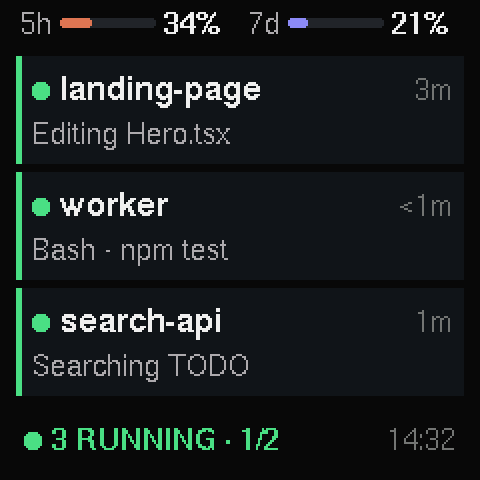<br><sub>Sessions at a glance</sub></td>
    <td align="center">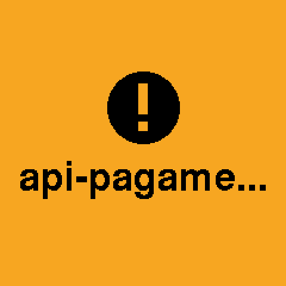<br><sub>A session needs you</sub></td>
    <td align="center"><br><sub>A response is really finished</sub></td>
  </tr>
  <tr>
    <td align="center"><br><sub>Idle: the mascot watches your limits</sub></td>
    <td align="center">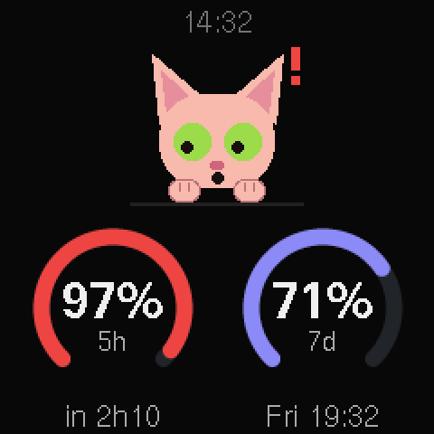<br><sub>...and panics near the limit</sub></td>
    <td align="center">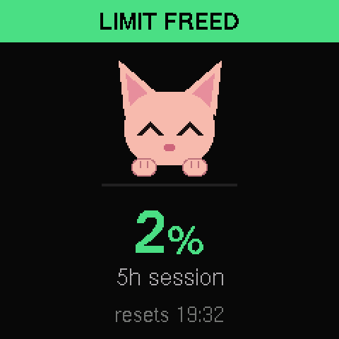<br><sub>The 5-hour window reset</sub></td>
  </tr>
  <tr>
    <td align="center">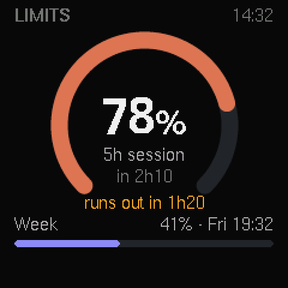<br><sub>Limits and a runs-out forecast</sub></td>
    <td align="center">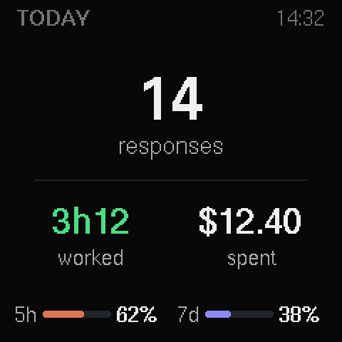<br><sub>Today's summary</sub></td>
    <td align="center">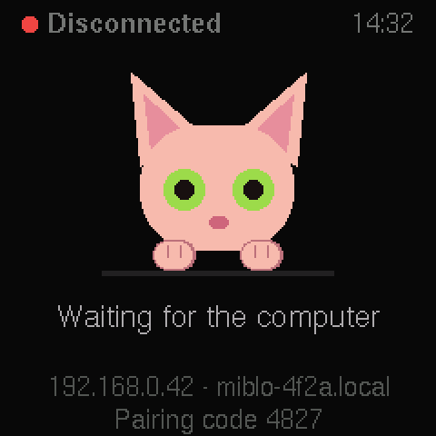<br><sub>Waiting for the computer</sub></td>
  </tr>
  <tr>
    <td align="center">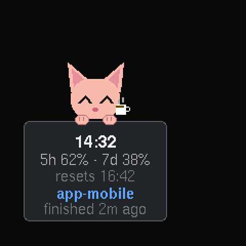<br><sub>Pet mode: oops, the coffee</sub></td>
    <td align="center">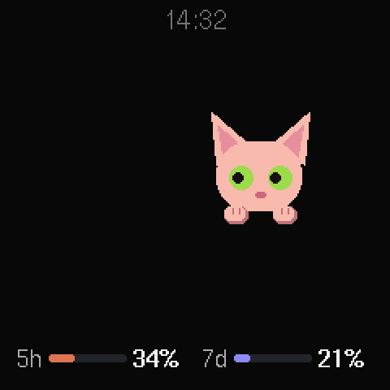<br><sub>Two Miblos: a Friday deploy</sub></td>
    <td align="center">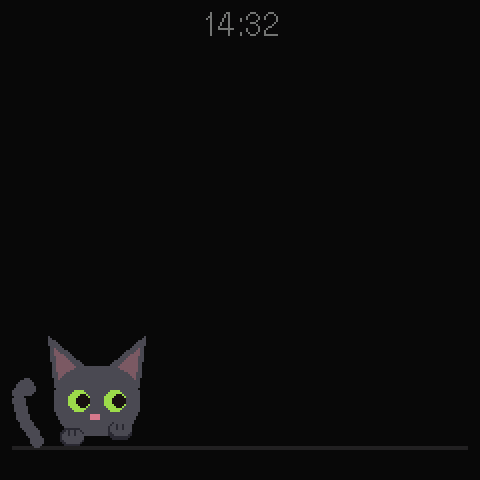<br><sub>Friday the 13th: a black cat passes by</sub></td>
  </tr>
  <tr>
    <td align="center">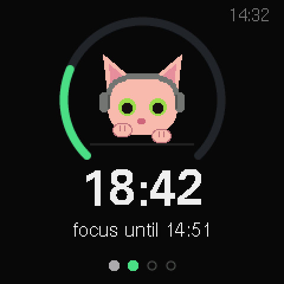<br><sub>Focus (Pomodoro) with <code>/miblo:focus</code></sub></td>
    <td align="center">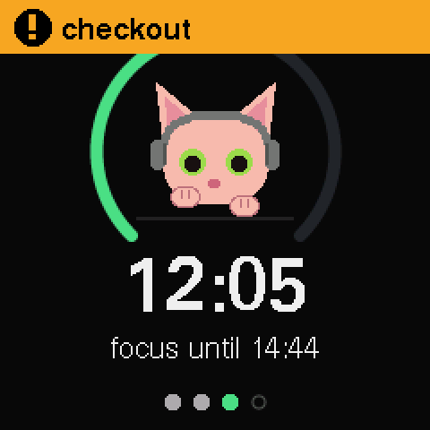<br><sub>A session needs you, even during focus</sub></td>
    <td align="center">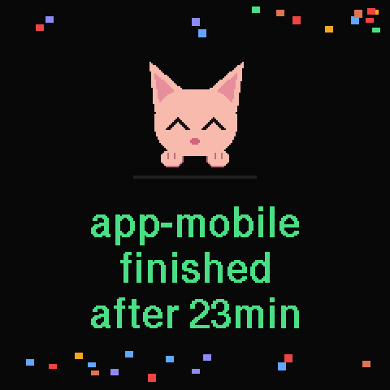<br><sub>A long task finished: the fanfare</sub></td>
  </tr>
  <tr>
    <td align="center">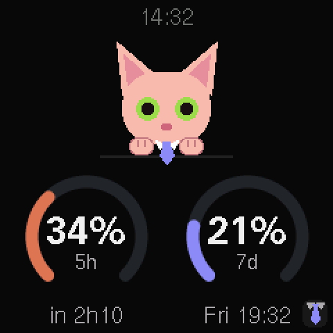<br><sub>Meeting mode: a tie, no names</sub></td>
    <td align="center">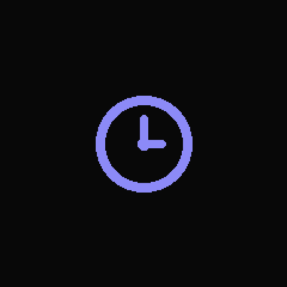<br><sub>A reminder comes due</sub></td>
    <td align="center">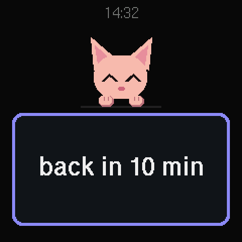<br><sub>A note for passers-by (<code>/miblo:say</code>)</sub></td>
  </tr>
  <tr>
    <td align="center">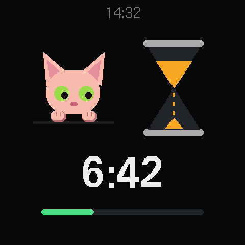<br><sub><code>/miblo:timer</code></sub></td>
    <td align="center">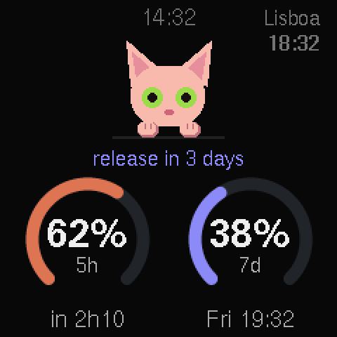<br><sub>A countdown and a second clock</sub></td>
    <td align="center">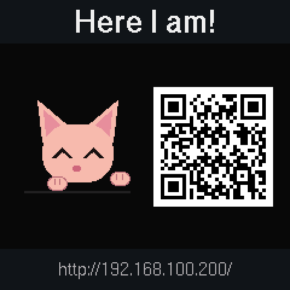<br><sub><code>/miblo:find</code>: wave and QR code</sub></td>
  </tr>
  <tr>
    <td align="center">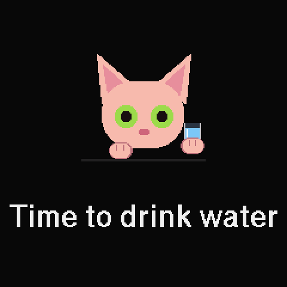<br><sub>Wellness nudges (off by default)</sub></td>
    <td align="center">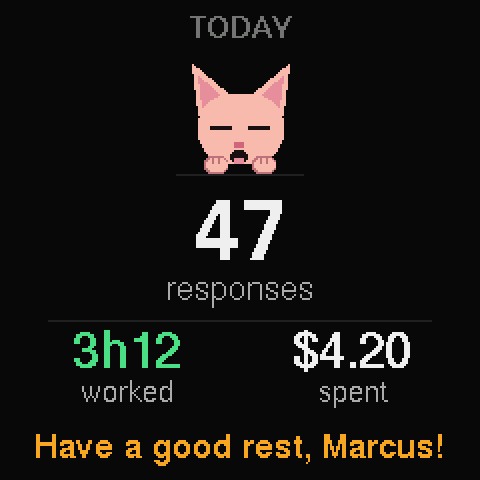<br><sub>The end of the work day</sub></td>
    <td align="center">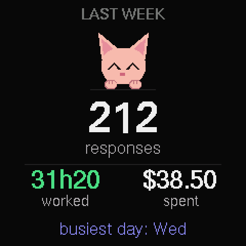<br><sub>Monday: last week's recap</sub></td>
  </tr>
  <tr>
    <td align="center">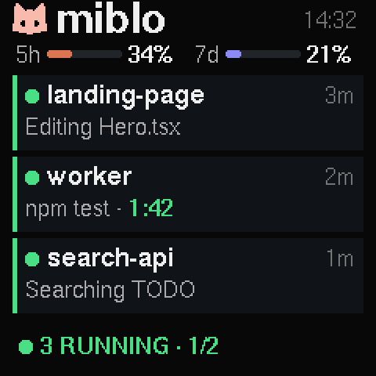<br><sub>A long command, timed</sub></td>
    <td align="center">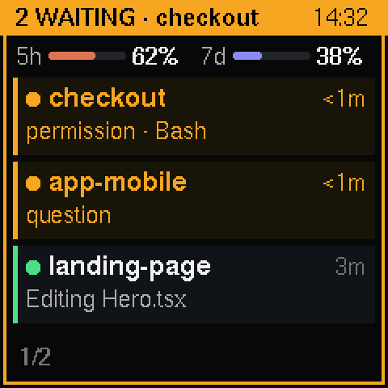<br><sub>The status frame, seen from the corner of your eye</sub></td>
    <td align="center">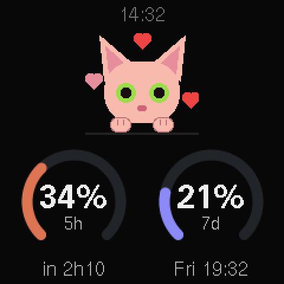<br><sub>Special days: Valentine's hearts</sub></td>
  </tr>
</table>

<p align="center"><b>30 antics</b> in pet mode and <b>37 scenes</b> when Miblos visit each other.</p>

<p align="center">
  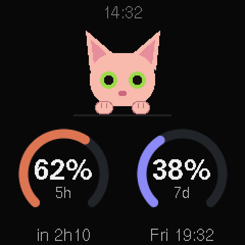
  
  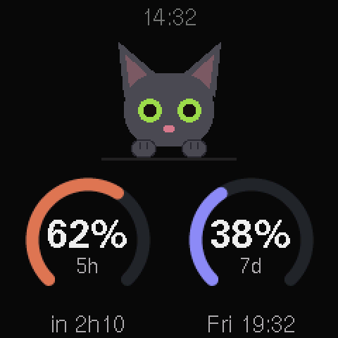
  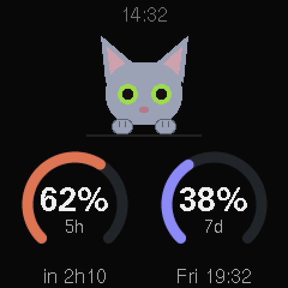
  <br><sub>Four mascot colours, set on the settings page</sub>
</p>

<sub>Rendered from the firmware's own drawing code and fonts (<code>make screenshots</code> / <code>make animations</code>), pixel for pixel what the 240&times;240 screen shows.</sub>

> **Disclaimer:** Miblo is an independent project. It is not affiliated with, sponsored by or endorsed by Anthropic. "Claude" and "Claude Code" are trademarks of Anthropic.

## Contents

- [Features](#features)
- [How it works](#how-it-works)
- [Quick start](#quick-start)
- [Commands](#commands)
- [Do It Yourself: build your own Miblo](#do-it-yourself-build-your-own-miblo)
- [Updating](#updating)
- [Reset and recovery](#reset-and-recovery)
- [Troubleshooting](#troubleshooting)
- [Development](#development)
- [License](#license)

## Features

**On the screen**

- **Overview** (the default mode) adapts to what you're doing:
  - **While something is running,** your sessions come first. You get up to 3 session cards per page, each with the name, how long it has been in that state and what it's doing now ("Editing Header.tsx", "Bash · npm test"). Above them is a compact `5h / 7d` limits strip. Cards are ordered by what needs you first, then what is still working, then what has finished.
  - **When nothing is running,** you first see "All done" with big 5-hour and weekly limits, the last session that finished and today's cost. After 20 s the desk mascot takes over (see below).
- **Alerts:**
  - **Amber** when a session needs you (a permission request or a question, including a prompt from a subagent or an agent-team worker, one that auto mode puts on screen, and an MCP server asking for input). You get a flash (2 blinks by default, 2 to 5 on the settings page), then a highlight with the tool and command, then a fixed amber band until you respond. The reminder repeats every ~2 minutes while it's still pending.
  - **Blue** when a response is truly finished. A session that is still waiting on subagents or background tasks stays "running" ("Waiting on 2 agents") and doesn't trigger the blue alert. A passive `monitor` background task (a watcher that stays alive for hours) doesn't count as work in flight.
- **Limits mode:** a large arc for the 5-hour window, a bar for the week and the time until each resets.
- **Limit forecast:** when your recent pace would use up the 5-hour window before it resets, the Limits screen says when, in amber ("at this pace, runs out at 15:40"), and the desk screen how long is left ("runs out in 1h20"). On the Overview, when that is less than 30 minutes away, the 5-hour number turns amber and "runs out ~15:40" takes the place of the reset time.
- **"Limit freed":** when the 5-hour window resets after real use (50% or more), the screen turns green and the mascot celebrates, with the new usage and the next reset.
- **Sessions mode:** a detailed list of big cards that you can read at arm's length. It pages every 5 s when there are more than 3 sessions, in the same order as the Overview.
- **Desk mascot:** 20 s after everything finishes (in any mode), the mascot takes the screen next to two ring gauges with your 5-hour and weekly limits, their reset times and the clock. It glances at the gauges and reacts to them: it naps when there's plenty left, bats at the fuller gauge past 50%, sweats past 80% and panics at 95%. It takes turns with the Limits arc and today's summary: 1 minute of mascot, 15 seconds of arc, 1 minute of mascot, 15 seconds of summary. Any activity brings the normal screens back.
- **Today's summary:** responses finished today, time with Claude working, today's cost and the limits. The count survives the bridge restarting and resets at midnight.
- **Mascot colours:** sphynx (peach), orange, black or grey, chosen on the settings page.
- **Pet mode and screen care:** after a few minutes with nobody using it (computer away, or nothing running; 15 min by default, 1 min to 1 h on the settings page), the mascot wanders slowly around the whole screen like a little desk pet, holding up a small sign: the clock, your 5-hour and weekly limits (a little clock for the session, a calendar for the week, each with its percentage), the next reset (or "limit freed"), and the last task that finished and how long ago. When the computer is away, a small crossed-out laptop sits in the sign's corner. Every 30 seconds it does something, never the same thing twice in a row: 30 antics in all. With the sign in its paws it bats at it, spills its coffee on it, chases the mouse cursor across it, naps on it, sneezes, plays peekaboo behind it, sends you a heart, puts on sunglasses or waves at you. Other times it sets the sign down at the bottom of the screen (everything on it stays readable) and plays: types on a laptop until a bug crawls out, chases its tail, stretches, licks a paw, hunts a fly, plays with a ball of yarn, pushes a mug off the edge, hides in a box, plays a little keyboard, chases a laser dot, pops soap bubbles, eats a fish snack, explains a bug to a rubber duck, sips a coffee, gets a butterfly on its nose, pops a balloon, swipes at a paper plane, dips a paw in a fish bowl, presses the deploy button, jumps at a cucumber or dozes off under a blanket. After a delay you choose on the settings page (15 min to 4 h, 1 h by default) the screen turns off; "never" keeps the pet wandering. Everything also shifts by a pixel or two every few minutes. LCDs can keep a faint ghost of an image left still for hours; none of this lets that happen. Any Claude Code activity, opening the settings page or `/miblo:pair` brings the normal screens back.
- **Several Miblos on one network (an easter egg):** Miblos in pet mode notice each other. A mascot says "Hi, Nina!" when another one shows up, and every few minutes a visit happens: one of them asks the network who is free, a group of 2 to 4 forms (1:1 most often, sometimes 1:2 or 1:3), and the host is drawn at random among the group, so every Miblo gets visited and goes visiting alike. The guests walk off their screens and into the host's, in their own colours; on the settings page you tell each Miblo where the others stand (right, left, above or below), so a cat leaving one screen comes in on the next. If the host's human gets back to work, the guests walk home, sulking. Each visit is one of 37 little scenes, most of them about something programmers know: a rubber duck to debug with, pair programming on a tiny laptop, a code review that ends in "LGTM", hunting a bug, a Friday deploy (a rocket takes off), a coffee (more likely when the other one's limits are past 80%), and many more, from a tug of war over a merge conflict to a daily stand-up, ping-pong, a kernel panic, a picnic or a kite. With many Miblos, each one visits the others at random. At night, sleeping Miblos nap in step. Only the gadget's name, mascot colour and a few flags go on the network (in pet mode, napping, limits past 80%); nothing about your sessions, and the network only sees the id (`Miblo-XXXX`). It's on by default; turn it off on the settings page. To see it without waiting, run `/miblo:demo`.
- **Greetings and special days:** the mascot says "Hi! I'm Tofu" when you name it. If it knows your first name, it says good morning (or good afternoon, or good evening) at your first Claude Code activity of the day. On your birthday it wishes you a happy birthday with a party hat and confetti. It also wears a Santa hat at Christmas, a witch hat at Halloween and a party hat at New Year, and celebrates its own birthday one year after its first day with you.
- **Disconnected screen:** when the computer stops sending updates, the mascot looks around for it (and falls asleep after 10 minutes). The screen still shows "Disconnected", the clock, the gadget's address and its pairing code.
- **Night mode:** dims the screen between two times you choose (for example 22:00 to 07:00 at 10%), in the gadget's time zone. It is set from the settings page or `/miblo:night`.
- **Blue light filter:** warms every colour on the screen, always or between two times you choose (its own schedule, separate from night mode), at three strengths: low, medium or high (white at 4500 K, 3500 K or 2700 K). At the highest strength the blue status colours look olive or greenish, as they do under any blue light filter. It is set from the settings page.
- **Optional rotation:** in Overview, switch to the Limits screen for a few seconds every so often. Alerts always take priority.
- **System panel:** under Advanced on the settings page, live graphs of the last minute of processing load and RAM in use (read once a second while it is open, kept only in the page), with how much is free, and storage as two bars: the program (the firmware against the largest one the gadget's flash layout takes) and the data (settings, pairings, notes), each with how much is in use and free.
- **Paired computers:** a card of its own on the settings page lists the computers paired with the gadget (up to 4), each with when it was last seen, a Rename and a Remove button; `/miblo:settings` marks the computer that opened the page. Each one is named after its host name, and follows it if it changes; rename one (up to 20 characters) and that name stays until you clear it.
- **9 languages** for the screen and the setup/settings pages: English, Português (BR), Português (PT), Español, Français, Italiano, Deutsch, Русский and 中文.

**Setup and maintenance**

- **Phone setup through a captive portal:** scan the QR code on the screen, join `Miblo-Setup-XXXX`, then pick your Wi-Fi. It must be the **same network as your computer**, otherwise the plugin can't find the gadget. The time zone and language come from your phone.
- **Automatic discovery** over mDNS (`miblo-xxxx.local`, `_miblo._tcp`) and pairing with a 4-digit code.
- **Settings page** in the browser (`http://miblo-xxxx.local`; a paired gadget first asks for the code shown on its screen) for mode, brightness, alerts (blinks and durations), discreet mode (hides commands and file paths), rotation, night mode, blue light filter, mascot colour, screen-off delay, time zone, language, device name, and your name and birthday. `/miblo:settings` opens it for you. Changing a setting requires the 4-digit code shown on the gadget's screen (proof you are the one in front of it); your name and birthday are never shown on the page until it is unlocked.
- **Firmware updates over Wi-Fi.** On a configured unit, every update needs a 4-digit code shown on the gadget's screen, so no one on the network can reflash it without physical access.
- **Nobody on the network can mess with it.** Every setting change, rename and firmware update needs either the paired plugin or the on-screen code; once a gadget is paired, other devices on the network only learn its id. A configured gadget that lost its Wi-Fi also asks for the on-screen code before its setup network lets anyone move it to another network. Requests are rate-limited and the gadget sheds load rather than ever freezing.
- **Up to 20 active sessions at once**, the ones that need you first; the rest cycle through the pages, and an alert is always shown even when memory is tight.
- **Hard reset without a computer:** power it on 6 times in quick succession, with an on-screen countdown you can cancel (see [Hard reset](#hard-reset)).

### Daily life

- **Focus (Pomodoro):** `/miblo:focus` starts 25 minutes of focus and 5 of break, 4 rounds, with a 15-minute long break at the end (`/miblo:focus 50` for 50 and 10, `/miblo:focus 25 5 4` to choose all three, `/miblo:focus stop` to end it). The mascot puts on headphones and types inside a progress ring, with the time left in big numbers and "focus until 15:30" under it, readable from across the room, and the rounds as dots. Each focus round ends with three slow pulses and a stretch; each break ends with "Back to focus?" for a minute, then the next round starts by itself. Alerts that need you still come through; "finished" waits for the break (a setting, on by default). The gadget doesn't go into pet mode or turn the screen off during a focus. The timer runs on the gadget, so the computer can go away; restarting the gadget ends it.

- **Meeting mode:** `/miblo:meeting` (60 min), `/miblo:meeting 30` (1 to 480 min) or `/miblo:meeting off`. While it lasts no screen shows project, tool or command names, alerts never show which session or command ("A session needs you", "Finished after 7:07"), the flash blinks once, the mascot wears a tie and a small tie badge sits in the bottom-right corner. An alert that needs you still takes the screen. It ends by itself; a restart ends it too.
- **Insistence:** when the same wait goes on (the reminder every few minutes, set on the settings page), from the 3rd reminder the flash blinks twice as long and the alert stays twice as long, and from the 5th it blinks red. It starts over once nothing waits for you. On by default; turn it off on the settings page.
- **Long task fanfare:** when a response that took a while finishes (5 min by default; 3, 5 or 10 min, or off, on the settings page), the "finished" alert becomes a party for 8 seconds, readable from across the room: confetti, the mascot hopping and "app-mobile finished after 23min". Short tasks keep the normal alert. In meeting mode it shows no name; during a focus round it waits for the break, like any "finished".

- **A wait is never hidden:** while a focus, a timer, a note, a nudge or any other of these screens is up, a session that needs you shows as an amber band across the top with its name ("checkout", "+1" when more wait; "NEEDS YOU" in meeting mode) until you answer it.

- **Healthy breaks (off by default):** three nudges you turn on in the settings page's Wellness section. **A break** after long continuous work (60, 90 or 120 min of Claude working; gaps of up to 10 minutes still count as continuous, a longer one starts over): the mascot stretches and suggests "How about a 5 min break?" for a minute. **Water** every 60 or 90 minutes inside your work hours: the mascot sips from a glass, "Time to drink water", for 20 s. **Eye rest (20-20-20)**: every 20 minutes of continuous work, the mascot gazes into the distance, "Look far away", for 20 s. No flash and no sound. They never show during an alert, focus, a meeting, a timer or a note, or in pet mode; one that comes due while something else is on waits up to 5 minutes for a gap, then is skipped.
- **End of the day (off by default):** at the end of your work hours (18:00 on weekdays by default; the same hours the water nudge uses), the mascot yawns over today's summary for a minute: responses, time with Claude working and cost, and "Have a good rest, Marcus!" (with your name when it knows it). Once a day, within two hours of the end of the work hours; if a session is still running it waits for it to finish (up to an hour). Afterwards pet mode comes sooner (after 5 idle minutes) for the rest of the day.
- **Monday recap:** on Monday mornings, at your first Claude Code activity from 05:00 (or at 09:00), the screen shows last week for a minute: hours with Claude working, responses, cost and the busiest day. It needs the plugin from the same release; turn it off on the settings page.
- **The cat's mood:** after 8 hours of Claude working in a day the mascot looks tired (faint bags under its eyes, slow blinks and a yawn now and then); on a light day (under 2 hours, and no limit above 50%) it plays more often in pet mode. Only its expression and rhythm change, never a message.
- Anything that depends on the time of day (water, the end of the day, the Monday recap) stays quiet until the gadget knows the local time.
- **Notes on the desk:** `/miblo:say` puts a message on the screen for whoever walks by (the cat holds it on a sign; in pet mode it rides on the pet's card), for 30 minutes or as long as you choose. `/miblo:remind` sets a reminder in N minutes or at HH:MM, or a recurring alarm every day or on weekdays (up to 4 of each; recurring alarms are saved on the gadget and survive a restart). When one comes due the screen pulses and the cat holds it up for 5 minutes or until `/miblo:remind off`. `/miblo:timer` shows a big countdown with an hourglass, and `/miblo:find` makes the gadget wave for 10 seconds with a QR code for its settings page. Messages and reminders take up to 40 characters.
- **Seen from the corner of your eye:** a status frame (off by default) and slow pulses with the brightness up for focus, timers and alarms (at night at most twice the night brightness). A thin frame around the screen is amber while a session waits for you and green for a minute after one finishes; the end of a focus round, a timer, an alarm or a reminder pulses the whole screen in its colour three times (one soft pulse when a break ends), never over a permission alert, and warmed by the blue light filter like everything else.
- **More special days and looks:** on Valentine's Day (Feb 14) little hearts float around the mascot; on Easter Sunday (worked out on the gadget, every year) it wears bunny ears; on Programmer's Day (the 256th day of the year: Sep 13, or Sep 12 in a leap year) it wears glasses and greets you with "Happy Programmer's Day!". On a Friday the 13th, now and then a black cat walks across pet mode, stops to look at you and goes on its way. Only dates that are the same everywhere; your birthday and the gadget's always come first. Friends' cats visiting keep their own looks: no tie or tired eyes of ours.
- **Long commands in sight:** when Claude runs a shell command for more than 30 seconds, its card on the Overview shows the time running next to the command, in bold green ("npm test · 1:42"), so you can tell from across the room that it is still going; after an hour it reads "1h02". In discreet mode the time still shows, the command doesn't.
- **Second clock:** pick another time zone on the settings page (with a nickname of up to 12 characters, for example "Lisboa") and its time shows small in the Desk's top corner and under the Overview's footer when everything is done ("Lisboa 19:32").
- **Countdown and QR on the Desk:** `/miblo:countdown` puts a countdown (saved on the gadget) over the Desk's ring gauges ("release in 3 days"), with confetti on the day itself, and on the pet's sign in place of the last task (a note or a friend's hello still comes first). An optional QR code with the settings page's address can sit in the Desk's top corner (settings page; off by default), on screens big enough for a phone to read it.
- **Where to set it all:** on the settings page, under Alerts, "insist more on long waits" (on by default), "celebrate long tasks" (off, 3, 5 or 10 min; 5 by default) and the status frame around the screen (off by default). A **Wellness** card has the break after long work (off, 60, 90 or 120 min), the water reminder (off, 60 or 90 min), eye rest (20-20-20), "during focus, only 'needs you' alerts" (on by default), the end-of-day summary and Monday's summary of last week (on by default); the work hours and work days (09:00 to 18:00, Monday to Friday by default) show while the water reminder or the end-of-day summary is on. Under This device: a second time zone (off by default, from the same list as the main one) with the short name shown next to its time (up to 12 characters), and the settings QR code on the desk screen (off by default). Every wellness reminder is off until you turn it on.
- **From the plugin:** the bridge forecasts when the 5-hour limit runs out at the current pace, tells the gadget how long a shell command has been running, and on Mondays sends last week's totals (hours, responses, cost, busiest day).

**Privacy**

- Everything stays on your local network. The plugin's bridge listens only on `127.0.0.1` and talks to the gadget over your LAN. There's no cloud and no account.
- Usage limits, context and cost come only from Claude Code's **official status-line data**, never from undocumented endpoints. The status line is linked only with your consent, and your existing status line keeps working exactly as before.

## How it works

```
 Claude Code                        your computer                          your LAN
┌──────────────┐  hooks (async)   ┌──────────────────────────┐  HTTP + token  ┌──────────────┐
│  sessions    │ ───────────────▶ │  Miblo bridge (Node.js)  │ ─────────────▶ │ Miblo gadget │
│  status line │ ───────────────▶ │  listens on 127.0.0.1    │ ◀── mDNS ───── │  (ESP8266)   │
└──────────────┘  official JSON   └──────────────────────────┘                └──────────────┘
```

- **Plugin** (`plugin/`) is a Claude Code plugin in Node.js with no dependencies. Async hooks track every session's state and never slow Claude Code down. The status-line tap forwards a copy of the official status-line JSON and then runs your original status line command unchanged. A local bridge (started on demand, it exits after 30 minutes without sessions and hands over to a newer plugin at its first hook event) builds a small snapshot and pushes it to every paired gadget.
- **Firmware** (`firmware/`) is ESP8266 firmware for the GeekMagic "Ultra" desk clock (240×240 IPS). It joins your Wi-Fi, announces itself over mDNS, pairs with a 4-digit code (which issues a random 128-bit token; 5 wrong codes in a row lock pairing for 60 s, doubling up to 1 h) and draws the screens.

## Quick start

For someone who already has a Miblo gadget. To build one, see [Do It Yourself](#do-it-yourself-build-your-own-miblo).

**Requirement:** [Node.js](https://nodejs.org) **20 or newer** on your `PATH`. The native Claude Code installer doesn't include Node. macOS, Linux and Windows (including WSL) are supported.

1. **Install the plugin.** In Claude Code, run:

   ```
   /plugin marketplace add marcus-campos/miblo
   /plugin install miblo@miblo
   /reload-plugins
   ```

2. **Connect the gadget to Wi-Fi.** Plug it in. The screen shows a QR code and the network name `Miblo-Setup-XXXX`. Scan the code with your phone (or join that network), and the setup page opens. Pick your network and type the password.
   - Miblo works only with **2.4 GHz** Wi-Fi.
   - Your router needs **WPA2**. WPA3-only routers aren't supported. If a "WPA2/WPA3" mixed-mode router refuses the connection, switch it to WPA2.

   Once it connects, the screen shows "Wi-Fi connected", a 4-digit pairing code and the gadget's IP.
3. **Pair.** In Claude Code, run `/miblo:pair` and type the 4-digit code from the screen. It then asks what to call the gadget (up to 20 characters). A name helps when you have several Miblos. Reply `keep` to leave it as `Miblo-XXXX`. It also offers to tell the gadget your first name and birthday, so it can greet you. Reply `skip` if you'd rather not.
4. **Allow the status line link.** `/miblo:pair` asks before linking your status line. This link is what the limits, context and cost need. Your current status line keeps working exactly the same. If you say no, you still get session states and alerts, but no limits. You can undo it any time with `/miblo:unlink-statusline`.

The gadget updates on your next Claude Code activity.

## Commands

The gadget `id` is shown by `/miblo:status`. When only one gadget is paired, you can leave it out wherever it's optional. The daily-life commands (focus, meeting, find, timer, say, remind, countdown) go to every paired gadget; add `--id <id>` to send one to a single gadget.

| Command | Arguments | What it does |
|---|---|---|
| `/miblo:pair` | `[ip]` | Finds gadgets over mDNS (or uses the IP you give), asks for the 4-digit code on the screen and pairs. It then asks what to call the gadget, offers to tell it your name and birthday, and offers to link the status line. |
| `/miblo:status` | | Shows whether the bridge is running and the status line is linked, and lists each paired gadget (online/offline), the active sessions, the limits and today's summary (responses finished, time worked, cost). |
| `/miblo:mode` | `<overview\|limits\|sessions> [id]` | Sets a gadget's display mode. |
| `/miblo:rotate` | `<on\|off> [every-seconds] [show-seconds] [id]` | In Overview, shows the Limits screen for `show-seconds` once every `every-seconds`. `every` must be 10–3600 s, `show` must be 3–300 s and shorter than `every`. With no arguments, it shows the current setting and offers presets (every 1 min for 10 s, every 5 min for 15 s, every 15 min for 20 s, or off). |
| `/miblo:night` | `<on\|off> [HH:MM HH:MM] [brightness%] [id]` | Dims the screen between the two local times (the window may cross midnight) to the night brightness (1–100%, never brighter than the normal brightness). With no arguments, it shows the current setting and offers presets (22:00–07:00 at 10%, 23:00–07:00 at 5%, 20:00–08:00 at 20%, or off). |
| `/miblo:rename` | `[id] [name]` | Renames a gadget (up to 20 characters). The name shows on the gadget screen, in the `/miblo` commands and, with visits on, to the other Miblos it visits. The network itself (mDNS) only ever sees the id-based `Miblo-XXXX`. With no arguments, it asks which gadget and the new name. `--default` brings back `Miblo-XXXX`. |
| `/miblo:owner` | `[id] [--name <name>] [--birthday <DD/MM>]` | Tells the gadget your first name and birthday (day first, e.g. `14/03`, or `03-14`), so it says good morning and wishes you a happy birthday. `clear` removes either one. Both stay on the gadget only. |
| `/miblo:demo` | `[minutes\|stop]` | Needs two or more paired Miblos. Puts them all in pet mode right away (10 minutes by default, 1–30), to show it off or to test visits between Miblos: the first visit comes within about 10 seconds. Alerts still show; it ends when Claude Code starts new work, or early with `stop`. |
| `/miblo:today` | | Today's summary in the terminal: responses finished, time with Claude working, cost, the limits with their resets and forecast, and, with several sessions, which ones worked the most. |
| `/miblo:limits` | | The 5-hour and weekly limits, when they reset and, when the recent pace would use up the 5-hour window first, when it runs out ("at this pace runs out at 15:40"). |
| `/miblo:focus` | `[focus-min [break-min [rounds]]] \| stop \| status` | Starts a focus session (Pomodoro) timed on the gadget: 25 min of focus, 5 min breaks and 4 rounds by default (focus 5–120 min, break 1–60, rounds 1–12; with only the focus length the break is a fifth of it). A minute of "Back to focus?" follows each break, and a long break the last round. With no arguments and a focus already on, it shows the round and the time left. `stop` ends it. |
| `/miblo:meeting` | `[minutes] \| off` | Meeting mode for 60 min by default (1–480): no project, command or tool names on the screen (alerts say "A session needs you"), a single blink instead of the flash, a tie on the cat and a small tie badge in the corner. It never hides that a session needs you. Ends by itself or with `off`. |
| `/miblo:find` | `[--id <id>]` | The gadget blinks, the cat waves and the settings page's QR code shows for 10 s, to spot one Miblo among several. |
| `/miblo:timer` | `<minutes> \| stop` | A big visible countdown on the screen (1–180 min). When it ends, the screen pulses slowly and the cat holds "Time's up!". `stop` cancels it. |
| `/miblo:say` | `<text> [--min N] \| off` | A message for people passing by your desk ("back in 10 min"), held up by the cat for 30 min by default (1–480) or until `off`. Up to 40 characters (47 bytes, so fewer with emoji or CJK). |
| `/miblo:remind` | `<minutes\|HH:MM> <text>`, `every day\|weekdays <HH:MM> <text>`, `off [N]` | A reminder in N minutes (1–1440) or at a time (today, or tomorrow if it has passed), up to 4 per gadget, plus up to 4 recurring ones (every day or weekdays, also `todo dia` / `dias úteis`) saved on the gadget. At the time, the screen pulses slowly and the cat holds the text (up to 40 characters) for 5 minutes. With no arguments it lists them with their numbers; `off` dismisses the one on screen, `off N` deletes reminder N. |
| `/miblo:countdown` | `<label> <DD/MM[/YYYY]> \| off` | A countdown on the desk screen and the pet mode sign ("release in 3 days"), saved on the gadget. Day first; without a year it's the next such date. Label up to 20 characters. With no arguments it shows the current one. |
| `/miblo:settings` | `[id]` | Opens the gadget's web settings page in your browser and prints its URL (also reachable at `http://<id>.local`). A paired gadget's page asks for the code shown on its screen first. |
| `/miblo:update` | `[id] [--file path]` | Updates the plugin and then the gadget firmware from the latest GitHub release. You confirm each step and type the on-screen code. `--file` sends a local `miblo-<board>-<version>.bin` instead. |
| `/miblo:link-statusline` | | Links Claude Code's status line to Miblo. Your original status line keeps its exact output. |
| `/miblo:unlink-statusline` | | Restores your original status line. **Run this before uninstalling the plugin.** |
| `/miblo:reset` | `<id>` | Factory-resets a paired gadget, which erases its Wi-Fi, pairings and settings. It asks you to confirm first. |

## Do It Yourself: build your own Miblo

### What to buy

A **GeekMagic "Ultra"** desk clock (also sold as **SmallTV Ultra**). It has an ESP8266 (ESP-12E/F, 4 MB flash) and a 240×240 ST7789 IPS screen. Out of the box it broadcasts its own Wi-Fi network named **`GIFTV`**, **`SmallTV`** or **`GeekMagic`**. You also need a decent **5 V / 1 A** USB power supply.

Other boards can be added: the firmware separates board-independent logic from a small per-board layer. See [`firmware/boards/README.md`](firmware/boards/README.md).

### Option A: no toolchain (browser only)

The stock GeekMagic firmware has too little space for over-the-air updates to take the full Miblo image in one go (the upload fails with **"Not Enough Space"**). So you install it in two steps: first a tiny installer, then the full image.

1. From the [latest release](https://github.com/marcus-campos/miblo/releases/latest), download both files:
   - `miblo-loader-geekmagic_ultra-<version>.bin` (the installer)
   - `miblo-geekmagic_ultra-<version>.bin` (the full firmware)
2. Connect the clock to your Wi-Fi through its stock setup portal: join its `GIFTV` / `SmallTV` / `GeekMagic` network and follow the clock's instructions. Note the IP it shows.
3. Open the clock's web page (`http://<clock-ip>/`), go to its **firmware update** page and upload the **loader** (`miblo-loader-…bin`) first.
4. The clock reboots and shows **"Miblo installer"** with an address like `http://<ip>/update`. Open that address and upload the **full image** (`miblo-geekmagic_ultra-…bin`). The screen shows "Installing Miblo..." without a progress bar. Wait for the browser to show "OK".
   - If the installer can't reach your Wi-Fi within 20 s, it also opens an open network `Miblo-Installer-XXXX`. Join it and use the address shown on the screen.
5. The clock reboots into Miblo and shows the **`Miblo-Setup-XXXX`** QR code. After a successful install, the installer erases the Wi-Fi the clock was using, so continue with the [Quick start](#quick-start).
   - To keep the current Wi-Fi instead, upload to `http://<ip>/update?keepwifi=1`.
   - A failed upload erases nothing, and the installer stays up so you can retry.

Keep the official GeekMagic `.bin` if you ever want to go back (see [Restoring the stock firmware](#restoring-the-stock-firmware)).

### Option B: build from source

You need Python 3 and git. PlatformIO goes in a local virtualenv:

```sh
git clone https://github.com/marcus-campos/miblo.git
cd miblo/firmware
python3 -m venv .venv && .venv/bin/pip install platformio
make build     # native tests + both images
make images    # rebuild only if the images are missing or older than the sources
```

The images land in `firmware/dist/`:

- `firmware/dist/miblo-geekmagic_ultra-<version>.bin` (the full firmware)
- `firmware/dist/miblo-loader-geekmagic_ultra-<version>.bin` (the installer)

The version comes from `firmware/include/miblo_version.h`. The git short hash is embedded as the build ID, which is shown on the boot screen and in `GET /api/info`. Flash them as in option A, or use the fleet tools below. `make help` lists every target.

### Flashing many units

`firmware/scripts/flash-fleet.py` (Python 3.9+, no dependencies) does the two-step install and version check for you, and the `Makefile` wraps it. Run these from `firmware/`. The fleet targets rebuild the images first when they're missing or out of date.

**Straight out of the box, through each unit's own access point (macOS).** Factory units aren't on any network. The Mac joins each unit's Wi-Fi in turn (one at a time, because it has one radio), flashes it at `192.168.4.1` and rejoins its own network at the end, also on errors and Ctrl-C.

```sh
make fleet-ap-plan    # scan for GIFTV/SmallTV/GeekMagic/Miblo-* units and show the plan (joins nothing)
make fleet-ap         # flash/update every unit in range, then stop
make fleet-ap-loop    # keep going as you power units on, one after another (Ctrl-C to stop)
make fleet-ap SSIDS="Miblo-Setup-4F2A GIFTV"   # only these networks, joined by name (no scan)
make fleet-ap-scan    # print what the Wi-Fi scan sees
```

- **Stock units** get the installer, then the full image. The script then joins `Miblo-Setup-XXXX` to check the version. Use `ARGS="--stock-ssid REGEX"` / `--stock-pass` if yours use other network names or a password.
- **Many units powered at once.** Factory units all use the same network name (for example ten `GIFTV`s). The script tells them apart by MAC address: it joins each one by its BSSID (through the `MibloWiFiScan` helper), visits every unit exactly once per run, and never goes back to one it already finished. The summary lists them as `GIFTV 4f2a`, `GIFTV 1a2b`… Without the scan helper it joins by name and uses the MAC it reaches to skip units already done.
- **Units already on `Miblo-Setup-XXXX`** are skipped when they're up to date and otherwise updated. A **never-configured** unit (one that never joined a Wi-Fi from its portal and was never paired) updates from its own access point without a code. Any unit that was configured once asks for the 4-digit code on its screen, even after a factory reset.
- **Location permission.** macOS shows Wi-Fi network names only to apps with Location Services access, and command-line tools can't get it. So the scan runs in a tiny helper app, **`MibloWiFiScan`**. The script builds it with Swift on first use (this needs the Command Line Tools: `xcode-select --install`). When macOS asks **"MibloWiFiScan would like to use your location", click Allow**. If you dismissed the prompt, turn it on in System Settings → Privacy & Security → Location Services → MibloWiFiScan. Without the scan, the script can still join networks by name (`SSIDS=…`, `ARGS="--try-ssid NAME"`, and `GIFTV`/`SmallTV`/`GeekMagic` are tried automatically).

**Over the LAN.** For units that are already on the bench Wi-Fi (stock units joined once through their stock portal):

```sh
make fleet-plan              # find units on this Mac's /24 and print what would happen
make fleet                   # install Miblo on every stock/installer unit found
make fleet HOSTS="192.168.0.41 192.168.0.42"   # only these units (or SUBNET=192.168.0.0/24)
make fleet-update-plan       # find configured Miblo units via mDNS and show what would be updated
make fleet-update            # update the older ones; each unit shows a 4-digit code you type in
```

`fleet-update` finds units by itself over mDNS (`_miblo._tcp.local`), so you don't need `HOSTS=` or `SUBNET=`. `HOSTS=` overrides discovery, and an explicit `SUBNET=` is searched alongside it. Units are flashed in parallel (`JOBS=`, default 50 in the Makefile; the script alone defaults to 4). Updates of configured units run one at a time because each one needs its code. The script prints a line per step and a final table, and exits non-zero if any unit failed. For every flag, run `python3 firmware/scripts/flash-fleet.py --help`.

**Units ship clean.** After a LAN install, the installer erases the bench Wi-Fi, so each unit restarts on its own `Miblo-Setup-XXXX` network, ready for its owner. On macOS the script then joins each of those networks to check the version. `ARGS=--keep-wifi` keeps the units on the bench network instead, and `ARGS=--no-ap-verify` skips the check.

### Safety notes

- **Use a proper 5 V / 1 A supply.** A weak supply (a phone charger, a laptop port or an unpowered hub) can brown out during Wi-Fi bursts. **Six quick power-ons in a row count as a hard reset**, and repeated brown-outs can look exactly like that.
- **Configured units always need the on-screen code for firmware updates**, whether from the web page, `/miblo:update` or the fleet script. A Bearer token alone isn't enough.
- Keep a copy of the official GeekMagic firmware before flashing.

## Updating

- **On the gadget:** right after it starts, if a newer firmware exists, the screen says "Update available" with both versions for 5 seconds, then carries on (the plugin tells it the latest release).
- **On the settings page:** **Check for updates** asks GitHub from your browser and, when there's a newer version, shows how to install it and a link to its file.
- **When pairing:** `/miblo:pair` checks right away and offers to update if the gadget is behind.

When a Claude Code session starts, the plugin checks GitHub for a newer release (at most every 6 hours, with a 2-second timeout so it never slows the start). If the plugin or a paired gadget is behind, you get a one-line notice to run `/miblo:update`, at most once a day for the same version.

- **From Claude Code:** `/miblo:update` checks the latest GitHub release and offers to update the **plugin** first, then the **firmware** of each paired gadget that's out of date. Type the 4-digit code shown on the gadget. It takes about a minute, so don't unplug the gadget while it runs. Pairing and settings are kept. If Claude Code asks you to, run `/reload-plugins` afterwards.
- **From the browser:** open `http://miblo-xxxx.local/update` (or `http://<ip>/update`). The gadget shows a 4-digit code. Type it, choose the `.bin` and upload. The screen shows a progress bar and the gadget reboots when it's done.

A paired gadget's `/update` page does not show the version either. While another code is on the screen (for a setting change, a reset or a Wi-Fi change), a second request is refused with "busy" and never replaces it; wait for the first code to expire.

The boot screen shows the firmware version and build (for example `v1.0.0 (4534fb8)`), and `GET /api/info` reports the same. Once a gadget is paired, `GET /api/info` answers only `id`, `paired` and `proto` unless the request carries a paired computer's token (`Authorization: Bearer <token>`), its mDNS announcement carries only its id, and its settings page asks for the code on its screen before showing anything.

## Reset and recovery

- **From the settings page:** `http://miblo-xxxx.local` → **Factory reset**, confirmed with the code shown on the screen.
- **From Claude Code:** `/miblo:reset <id>`.
- **Without a computer:** see [Hard reset](#hard-reset) below.

A factory reset erases Wi-Fi, pairings and settings, and brings back the setup QR code. Ordinary power cuts erase nothing. If your router is down for 2 minutes, the gadget opens its setup network and keeps retrying the saved one, so changing routers doesn't need a reset.

### Hard reset

Use this when you can't reach the gadget at all, for example after moving it to another network or losing its pairing. You only need the power cable.

1. Plug the gadget in, wait about 2 seconds for the screen to light up, then unplug it. Each power-on must last **less than 10 seconds**.
2. Repeat until it has been powered on **6 times in a row**.
3. From the 3rd quick power-on, the screen shows an amber countdown: "Quick restarts left to reset: N".
4. On the 6th power-on it shows "Factory reset", erases everything and restarts on the setup QR code.

**To cancel,** leave it on for 10 seconds at any point: the count goes back to zero. Only real power-ons count. Crashes, firmware updates and software restarts never add to it.

### Restoring the stock firmware

Miblo's own update page (`http://miblo-xxxx.local/update`, with the on-screen code) also accepts the official GeekMagic `.bin`. Upload it there to go back to the original clock firmware.

## Troubleshooting

| Problem | What to do |
|---|---|
| `/miblo:pair` finds no gadget | Check that the gadget shows a pairing code and is on the same network as your computer. mDNS is often blocked on WSL2, VPNs and corporate networks. In that case, run `/miblo:pair <ip>` with the IP shown on the gadget's screen. |
| Screen says **Wrong password** | The password was wrong. Scan the QR again and retype it. |
| Screen says **Network not found / Use a 2.4 GHz network** | The gadget can't see the network. Miblo supports only 2.4 GHz. Enable the 2.4 GHz band or use a separate 2.4 GHz network name, and move closer to the router. |
| Screen says **Connection refused / Check password or use WPA2** | The router rejected the gadget. Check the password. If the router uses WPA3 or "WPA2/WPA3" mode, switch it to WPA2, because Miblo doesn't support WPA3. |
| Screen says **Could not connect / Error code N** | Another connection failure. Check the network and try again from the setup QR. |
| No limits on the screen ("limits unavailable") | Run `/miblo:status` to see whether the status line is linked. If it isn't, run `/miblo:link-statusline`. Limits appear after the next response. The 5-hour and weekly limits exist only on **Pro/Max** subscriptions. With an API key, the gadget shows today's cost instead. |
| `/miblo:status` or `/miblo:update` says a gadget is `unauthorized` or "no longer accepts this pairing" | The gadget was reset or paired to something else. Run `/miblo:pair` again. |
| Gadget shows **Disconnected** | It hasn't received anything for 30 s. The bridge starts again with the next Claude Code activity. Check `/miblo:status`. |
| Blank status line after uninstalling the plugin | Always run `/miblo:unlink-statusline` **before** uninstalling. If you already uninstalled, reinstall the plugin, run `/miblo:unlink-statusline`, then uninstall again. |

## Development

**Commits:** no AI attribution. Commits, pull requests, tags and release notes must never carry `Co-Authored-By` trailers or "Generated with ..." lines for AI assistants. AI assistants working in this repository follow [`CLAUDE.md`](CLAUDE.md) (also [`AGENTS.md`](AGENTS.md)).

### Repository layout

```
.claude-plugin/        marketplace manifest
plugin/                Claude Code plugin (Node.js ≥ 20, zero dependencies)
  bin/                 hook.js, statusline-tap.mjs, bridge.js, miblo.js (CLI), onboard.js
  commands/            the /miblo:* slash commands
  hooks/hooks.json     hook registrations
  lib/                 session tracker, metrics, snapshot builder, device manager, mDNS, updates
  test/                node:test suites + a fake device (plugin/test/fakes)
firmware/              ESP8266 firmware (PlatformIO / Arduino)
  lib/miblo_core/      board-independent logic: snapshot, alerts, i18n, pairing, mDNS, time zones
  lib/miblo_ui/        screens, drawn on a 240 grid scaled to the board's screen
  boards/<board>/      per-board pins, screen, fonts, capabilities
  src/                 app, HTTP API, web pages, platform (Wi-Fi, OTA, storage)
  loader/              the stage-1 installer
  scripts/             build.sh, flash-fleet.py (+ tests), bump-version.py, macOS helper
  test/                native unit tests
  tools/screenshots/   renders every screen to PNG on the computer (make screenshots)
fixtures/snapshots/    protocol fixtures shared by plugin and firmware tests
docs/                  on-device release checklist; media/ holds the README's screens
CLAUDE.md, AGENTS.md   rules for AI coding assistants (no AI attribution in commits)
```

### Running tests

```sh
cd plugin && npm test                                  # plugin (also regenerates fixtures/snapshots)
cd firmware && .venv/bin/pio test -e native            # firmware logic + UI on the host
python3 -m unittest firmware/scripts/test_flash_fleet.py  # fleet script (or: cd firmware && make fleet-test)
cd firmware && make test                               # firmware native tests + fleet script tests
```

The bridge-to-gadget protocol is pinned by `fixtures/snapshots/*.json`: the plugin tests generate them and the firmware tests consume them. Before a release, a person runs the on-device [firmware checklist](docs/firmware-checklist.md).

### Screenshots

```sh
cd firmware && make screenshots                 # dist/screenshots/<lang>/*.png
make screenshots LANGS="en pt-BR es"            # any of the 9 languages
```

Renders every screen (setup, alerts, Overview, Limits, Sessions, each expression of the desk mascot, Disconnected…) on the computer, with the gadget's own drawing code and fonts over a framebuffer (`tools/screenshots`). Each PNG comes at 240×240 (the panel's pixels) and 960×960 (`@4x`, nearest neighbour), ready for product photos and docs.

```sh
cd firmware && make animations                  # dist/animations/<lang>/*.mp4 + *.gif (needs ffmpeg)
```

Renders short looping clips the same way, frame by frame at 20 fps as the gadget redraws them: the desk mascot in each mood, Disconnected, and the permission and finished alerts (flash, then the alert screen). Each clip comes as an H.264 mp4 at 960×960 and a gif at 480×480 (nearest neighbour); `LANGS=` works as for screenshots.

### Releasing

From a clean working tree, run:

```sh
cd firmware && make release        # or: make release VERSION=0.3.0
```

It asks for the version (patch/minor/major/keep/other; Enter means patch) and bumps both `firmware/include/miblo_version.h` and `plugin/.claude-plugin/plugin.json`. It then runs the plugin and script tests, builds both images (with the firmware native tests) and commits `chore: release vX.Y.Z`. Finally it asks whether to create and push the `vX.Y.Z` tag.

### CI

- **`.github/workflows/ci.yml`** runs on pushes to `main` and on pull requests. It runs the plugin tests on Ubuntu, macOS and Windows with Node 20 and 22, and the firmware native tests plus the device and loader builds.
- **`.github/workflows/release.yml`** runs on `v*.*.*` tags. It checks that the tag matches both version files, runs the tests, builds the images and publishes a GitHub release with the `.bin` files and `SHA256SUMS.txt`.

### Adding a board

Add `firmware/boards/<board>/` and a PlatformIO environment, then declare the screen size and capabilities. The step-by-step guide is in [`firmware/boards/README.md`](firmware/boards/README.md).

## License

[MIT](LICENSE) © 2026 Marcus Vinícius Campos.

Embedded third-party fonts and libraries keep their own licenses:

- [`firmware/lib/U8g2TFT/THIRD_PARTY_NOTICES.md`](firmware/lib/U8g2TFT/THIRD_PARTY_NOTICES.md): U8g2_for_TFT_eSPI (BSD-2-Clause) and the bitmap fonts. The fonts are under permissive licenses (SIL OFL 1.1, X11, public domain).
- [`firmware/THIRD_PARTY_NOTICES.md`](firmware/THIRD_PARTY_NOTICES.md): the ESP8266 Arduino core (LGPL 2.1), TFT_eSPI, ArduinoJson, QRCode and the time zone table (the IANA tz database, public domain). License texts are in [`firmware/licenses/`](firmware/licenses/).
